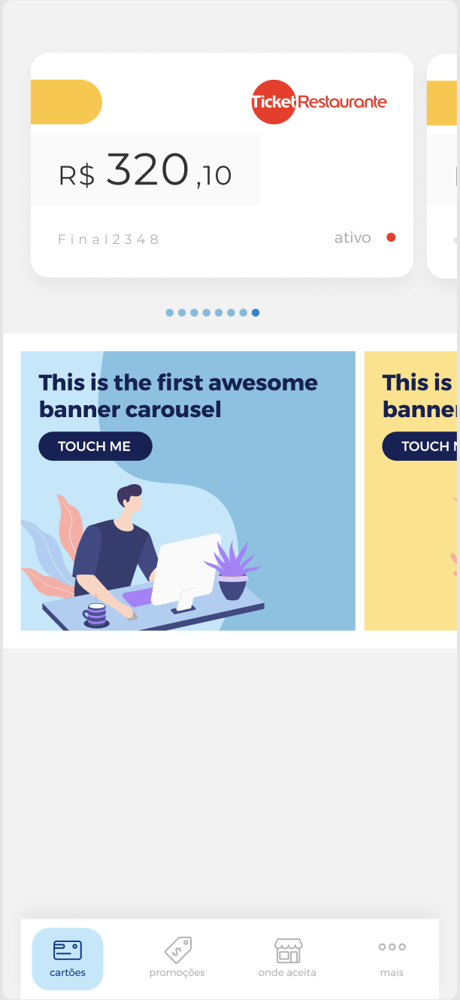

# Quer trabalhar em nosso time ? 

Esse é o nosso desafio para você!
O objetivo é você desenvolver um aplicativo que exiba uma dashboard de cartões usando uma API de capa (diferencial: criar testes unitários). Avaliaremos seu conhecimento e habilidades nos seguintes quesitos:

* Utilização de API
* Experiência do usuário
* Criação de tela e componentes
* Conhecimento da arquitetura proposta
* Conhecimento da solução

# Setup
Faça um fork do projeto para a sua conta e clone-o para o seu ambiente de trabalho;

# Instruções
Contrua um app que exiba os cartões na tela principal e apos clicar exiba o extrato do cartão. O layout da tela e a API para consumir estão nos links abaixo.

## Na dashboard, o usuário verá :

  

- Exibir a lista de cartão no formato carrossel (um do lado do outro)
- Exibir no cartão o saldo
- Ao clicar no cartão 

## Extrato :

  

- Exibir o saldo conforme layout no figma separado por mês

## A API da Dashboard 
API de conteúdo: https://raw.githubusercontent.com/gcmms/desafio-ios/master/api/dashboard.json

## Layout
Figma : https://www.figma.com/file/23cbubUfTFQ2rta1JswwMq/Desafio-Ticket?node-id=0%3A1

# O que será avaliado

* Design patterns
* Performance
* Organização
